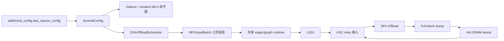

# vLLM-Ascend DSA Sparse Offload

本分支在 vLLM-Ascend v0.23.0 上实现 DSA 稀疏卸载，不修改配套的 vLLM
源码。实现以 GLM-5.1 为首要验收模型，并保留 DeepSeek-V3.2 兼容回归。

> 上游 vLLM-Ascend 项目说明原样保存在
> [README.upstream.md](README.upstream.md) 和
> [README.upstream.zh.md](README.upstream.zh.md)。

## 当前能力

- HBM KV cache 拆分为完整 Indexer K 平面和有界 resident MLA 平面；
- worker 持有固定容量、固定地址的 hot DRAM arena：A3 为 NOPE/ROPE，A5
  C8 为 656-byte packed payload；
- scheduler 统一管理 `PREFILL`、`DENSE_DECODE`、
  `ENTER_SPARSE_DECODE`、`SPARSE_DECODE` 请求布局；
- decode 整批执行 LI/resident-update -> KSC -> sparse attention，不按
  dense/sparse 拆分子 batch；A5 C8 复用社区 Quant-LI/QSFA；
- prefill 与 decode 新满 MLA block 通过独立
  `KvCacheFullBlockDump` 算子写入 DRAM；
- 支持 chunked prefill；完整 prompt 必须先在两个 dense plane 完成容量准入，
  中间 chunk 保持 PREFILL，下一轮 decode 才允许进入 DENSE/ENTER；
- eager 与 ACL FULL decode graph 共用同一套 InputBatch 行状态、
  resident pool、DRAM ledger 和算子缓冲；
- `DENSE`、`ENTER`、`SPARSE` 任意混排、不同 resident budget 和
  graph PAD 行可以复用同一 FULL decode 图族；
- DSA 关闭时保留 vLLM-Ascend v0.23 原生 cache 和执行路径。



## 代码集成

vLLM 通过 Python distribution entry point 发现 vLLM-Ascend 平台插件。
DSA 优先使用 v0.23 的 `AscendConfig`、KV spec registry、coordinator
factory、`scheduler_cls`、`NPUInputBatch` 和原生 FULL graph dispatcher
等扩展点。vLLM 尚无正式扩展点的 KV 分组、容量规划和
`KVCacheManager.allocate_slots()` 位置，复用 vLLM-Ascend 现有 patch
入口做带 DSA 类型守卫的窄适配；非 DSA 调用原样委托给上游实现。

因此，后续开发不应重新引入 vLLM 源码修改、全量复制上游 scheduler，或
恢复已退役的 GatherSelection 数据面。

## 最小配置

```python
from vllm import LLM

llm = LLM(
    model="/path/to/GLM-5.1-W4A8",
    tensor_parallel_size=16,
    quantization="ascend",
    block_size=128,
    max_num_seqs=4,
    max_model_len=131072,
    max_num_batched_tokens=131072,
    enable_prefix_caching=False,
    enable_chunked_prefill=False,
    async_scheduling=False,
    enforce_eager=True,
    additional_config={
        "dsa_sparse_config": {
            "enabled": True,
            "split_indexer_cache": True,
            "indexer_mla_block_ratio": 3,
            "sparse_activation_tokens": 6144,
            "prompt_budget_thresholds": [32768, 65536],
            "resident_budget_tokens": [6144, 10240, 12288],
            "max_active_reqs": 256,
            "hot_cpu_block_multiple": 3.0,
            "enable_row_mode_decode_graph": False,
            "trace_points": {
                "enabled": False,
                "points": ["first_sample"],
                "ranks": [0],
            },
        },
    },
)
```

图模式需要同时设置：

```python
enforce_eager=False
compilation_config={
    "mode": "VLLM_COMPILE",
    "cudagraph_mode": "FULL_DECODE_ONLY",
    "cudagraph_capture_sizes": [1, 2, 4, 8],
}
additional_config={
    "dsa_sparse_config": {
        # 其余配置同上
        "enabled": True,
        "enable_row_mode_decode_graph": True,
    },
}
```

首次部署或更新 DSA 自定义算子后，必须完整重编译并重新安装
vLLM-Ascend。

### A5 C8 增量配置

A5 当前只接通 SFA C8 与 LI C8 同时开启的完整数据面。在上述
`additional_config` 同级加入：

```python
additional_config={
    "enable_sparse_sfa_c8": True,
    "enable_sparse_li_c8": True,
    "dsa_sparse_config": {
        # 其余 DSA 配置同上
        "enabled": True,
    },
}
```

A5 两个开关全关或半开会在启动期明确拒绝；A3 继续使用既有 BF16/FP16
算子链。A5 C8 源码已接通，但在真实 A5 上完成构建、单算子 readback、eager
精度和 graph replay 前仍属于待验收能力。

## 当前边界

当前版本尚未支持：

- prefill/decode mixed batch；
- async scheduling；
- prefix cache；
- preemption/resume；
- speculative decoding 与 MTP；
- 外部 KV transfer connector；
- decode/prefill context parallel 和 pipeline parallel；
- KV-cache metrics/events；
- A5 C8 算子与端到端验收；
- A5 BF16 DSA 算子链。

具有显式配置入口的未支持组合会在启动期拒绝，preemption/resume 会在当前
运行边界明确失败。A5 已建立设备与 C8 布局 fail-fast，但源码接通仍不等于
设备验收。DP 和在线推理属于下一阶段扩展项，当前离线验证以 DP=1 为主。

## 文档与测试入口

- [DSA 稀疏卸载详细设计](docs/source/developer_guide/Design_Documents/dsa_offload_design.md)
- [A5 C8 数据面与算子合同](docs/source/developer_guide/Design_Documents/dsa_offload_a5_c8_design.md)
- [DSA demo 与测试说明](examples/dsa_demo/README.md)
- [上游 vLLM-Ascend README](README.upstream.md)

`simple_prompt_test.py` 延续旧版测试方式：先在文件顶部修改 `MODEL_PATH`、
`RUN_MODE` 和 prompt 等常量，再直接运行。`RUN_MODE` 可取
`disabled/cache-init/eager/graph`。

```bash
python -m pytest tests/ut/dsa_offload -vv --tb=short

python examples/dsa_demo/simple_prompt_test.py
```

数据集精度回归与评分分别使用
`examples/dsa_demo/qa_dataset_test.py` 和
`examples/dsa_demo/eval_dataset_acc_score.py`。正式精度、性能测试必须关闭
DSA trace points。
