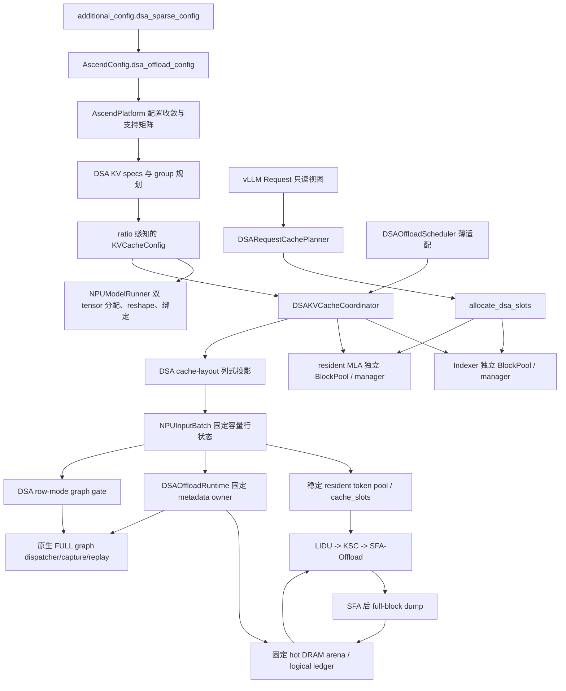
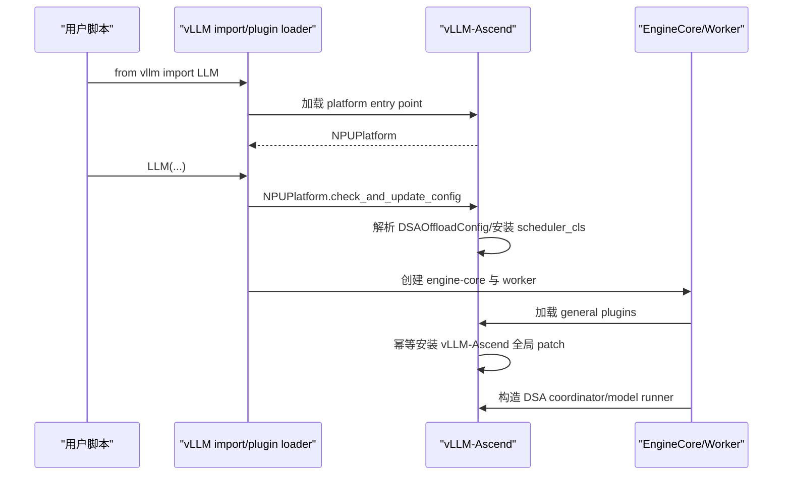
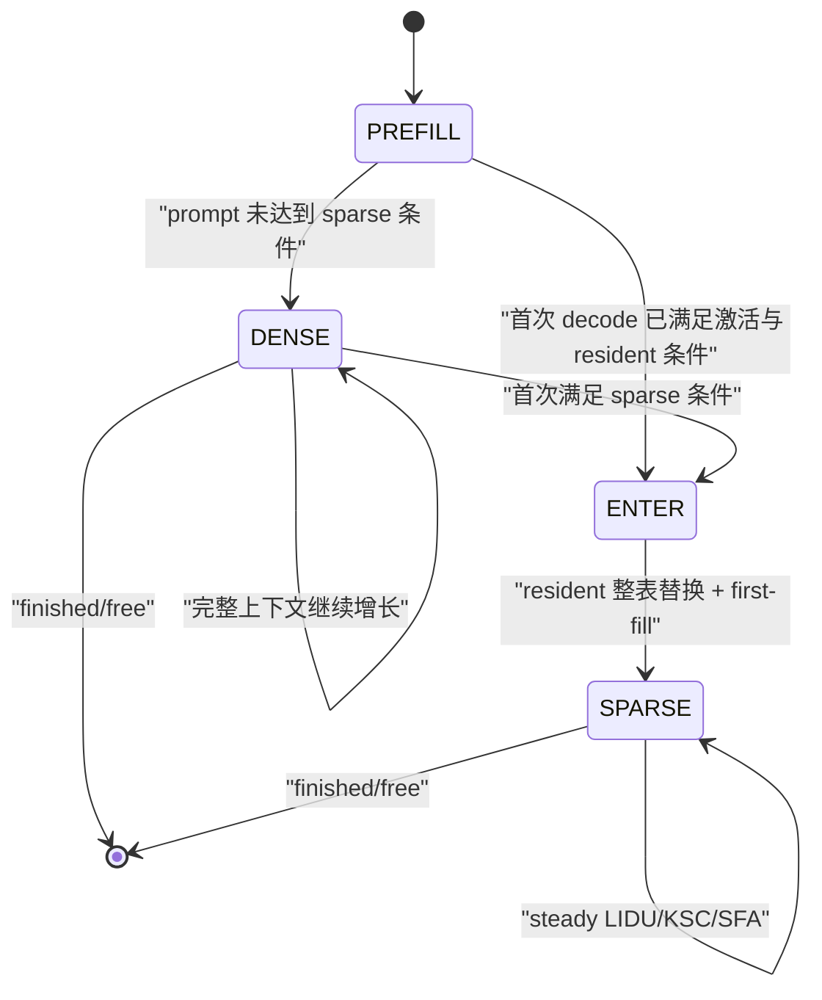

# DSA 稀疏卸载当前设计

> - 最后更新：2026-08-14
> - 目标基线：vLLM v0.23.0 + vLLM-Ascend v0.23.0
> - 当前完成度：核心控制面、eager 和 FULL decode graph 已完成 910C 初验；
>   chunked prefill 已完成分段 prefill/首 token 初验，完整 sparse decode
>   验收待补；A5 packed C8 数据面代码已接通，设备验收待进行
> - 首要验收模型：GLM-5.1；兼容回归模型：DeepSeek-V3.2

## 1. 文档定位

本文描述 **v0.23 分支当前已经落地的设计**，是公开项目中关于 DSA
“当前代码是什么结构、谁持有什么真源、稳定不变量是什么”的唯一设计真源。
后续每完成一个扩展场景，都应先按实际代码更新本文，再更新对应 demo 和
验收矩阵。尚未实现的能力只列接口边界，不写成可运行能力。

## 2. 目标与当前边界

DSA 稀疏卸载最终目标是在长上下文 decode 中实现：

1. Indexer K 保存完整上下文并驻留 HBM；
2. MLA 完整满块卸载到 worker 本地 hot DRAM；
3. HBM MLA 只保留有界 resident budget 与当前稠密尾块；
4. LIDU 选择重要 token 并更新 resident 映射；
5. KSC 只换入本轮 miss token；
6. SFA-Offload 消费重要 token 与尾块完成注意力计算。

当前代码已经完成：

- `additional_config["dsa_sparse_config"]` 的类型化解析和支持矩阵校验；
- 模型能力判断；
- Indexer/MLA HBM spec、容量、tensor、block pool 和绑定解耦；
- scheduler/core 侧请求 cache 布局规划；
- PREFILL、DENSE、ENTER、SPARSE 的双 pool block 分配；
- prefill 输出返回后的 resident 满块释放时序；
- 不复制上游 `Scheduler.schedule()` 的薄调度适配；
- scheduler/core 已提交状态到 worker 最终 `InputBatch` 行序的列式投影；
- ENTER 的 resident MLA block table 全量替换；
- 稳定 resident token pool 与逐层 `cache_slots`；
- 固定容量 hot DRAM arena 和请求逻辑块 ledger；
- prefill/dense/sparse 共用的双 plane slot mapping；
- 基于 v0.23 原生调度状态的 chunked prefill、增量双 plane 分配与逐 chunk
  满块 dump；
- eager LIDU→KSC→SFA-Offload 与 full-block dump 数据面；
- 复用原生 FULL decode capture/replay 的 row-mode 图数据面；
- A5 C8 的独立 Indexer key/scale、packed resident/DRAM、decode 融合
  Quant-LI/resident manager、纯 IO packed KSC、社区 QSFA 与 packed dump
  源码集成；prefill 仍复用社区 Quant-LI。

当前尚未完成：

- prefix cache、prefill/decode mixed、preemption/resume、
  speculative/MTP、async scheduling、KV transfer、KV-cache
  metrics/events 和 A5 设备验收。

当前已在 Linux + Ascend 环境完成 114 项 DSA UT，并取得 GLM-5.1 W4A8、
TP16/EP 的 disabled、cache-init、eager 与 FULL decode graph 初验证据。
graph 已覆盖 bsz=4 的同长度约 8K prompt，以及约
5K/20K/8K/40K 的混合长度与不同 resident budget。该结果证明
capture/replay 主路径可运行，但仍不替代完整 QA 数据集、长时间连续调度、
请求结束/行复用和 DeepSeek-V3.2 回归。chunked prefill 已在
`max_num_batched_tokens=4096/8192/16384` 下完成四条长短混合请求的
baseline/DSA 首 token 对照；由于该组测试只生成一个 token，它尚不能证明
后续 sparse decode 的完整正确性。

## 3. 当前总体架构



当前有三个不同层次的真源：

| 层次 | 真源 | 当前所有者 |
|---|---|---|
| 用户配置 | 解析后的不可变 DSA 配置 | `AscendConfig.dsa_offload_config` |
| 请求 cache 布局 | 阶段、冻结预算、resident 有效长度 | `DSARequestCachePlanner` |
| 物理块表 | 两个 plane 的 request→blocks 映射 | `DSAKVCacheCoordinator` 下的两个 manager |
| worker resident 映射 | request→稳定 pool row、逐层 token→slot | `DSAResidentTokenPool` |
| DRAM 逻辑账本 | pool row→logical full block→DRAM block | `DSAHotDRAMStore` |

worker 行状态是上述 scheduler/core 真源的 **投影**，不是第二套请求阶段
账本。eager 与 graph 后续都必须消费这个投影和同一个 buffer owner。

## 4. 与 v0.23 基线的集成方式

### 4.1 Python 插件发现与安装时序

DSA 实现只修改 vLLM-Ascend，不修改配套 vLLM checkout。这里的“零修改”
不等于 vLLM 不参与：vLLM 提供硬件插件发现与若干扩展点，Python 提供
distribution metadata 和运行时导入机制。

vLLM-Ascend 安装时在 `setup.py` 注册：

```text
vllm.platform_plugins:
  ascend = vllm_ascend:register

vllm.general_plugins:
  ascend_* = vllm_ascend:register_*
```

`from vllm import LLM` 首次导入 vLLM 后，vLLM 通过
`importlib.metadata.entry_points()` 查询当前 Python 环境中已安装
distribution 的这些 entry point。平台插件的 `register()` 返回
`vllm_ascend.platform.NPUPlatform`，后续配置收敛、模型 runner 和
attention backend 才进入 Ascend 实现。

engine-core 子进程还会加载 general plugins。它们通过
`vllm_ascend._ensure_global_patch()` 调用原生 `adapt_patch()`；
`_GLOBAL_PATCH_APPLIED` 保证同一进程重复触发时幂等。patch 必须早于被替换
函数首次用于构造 scheduler/cache manager；仅早于一次普通函数调用还不够，
因为其他模块可能已经用 `from ... import ...` 缓存了旧引用。



### 4.2 扩展点与窄 patch 的边界

| v0.23 扩展点 | DSA 用法 |
|---|---|
| `AscendConfig` | 解析并持有 `DSAOffloadConfig` |
| `KVCacheSpecRegistry` | 注册 DSA Indexer/resident spec 与 manager |
| KV group/config hook | 构造两个物理 group 和 ratio 容量 |
| coordinator factory | 创建 `DSAKVCacheCoordinator` |
| `scheduler_config.scheduler_cls` | 安装薄 `DSAOffloadScheduler` |
| `SchedulerOutput` dataclass | 浅包装为只增加一个 projection 的 Ascend 子类 |
| `NPUInputBatch` | 持有固定容量 DSA SoA 行状态 |
| `NPUModelRunner` cache 初始化 | 分配、reshape、绑定两个独立 plane |
| common/SFA attention metadata | 在同一份 resident metadata 上附带 Indexer/DSA view |
| `AscendSFAImpl` | DSA 开启时执行 LIDU/KSC/SFA-Offload 和层后 dump |

能够直接修改 vLLM-Ascend 的位置都采用显式类型和普通调用，不再为 DSA
单独制造 patch 层。vLLM v0.23 尚未给出正式扩展点的少数位置，DSA 复用
vLLM-Ascend 已有 patch 模块：

| 现有 patch 模块 | DSA 窄适配 |
|---|---|
| `patch_kv_cache_utils.py` | 识别 DSA split spec/group，接管分组、ratio 容量和容量报告 |
| `patch_kv_cache_coordinator.py` | 识别 DSA group 创建 coordinator，并仅对 `DSAKVCacheCoordinator` 调用 `allocate_dsa_slots()` |

每个 wrapper 都先用类型化 spec/group/coordinator 判断是否为 DSA；不满足
时调用保存的上游原函数。不能再为同一目标函数叠加第二个 DSA wrapper，
因为 Python 属性替换遵循最后一次赋值，多个互不知情的 wrapper 会产生安装
顺序依赖。新逻辑应合并到现有 wrapper，并继续依赖 vLLM-Ascend 全局 patch
的进程内幂等安装。

DSA 没有 patch `Request`，没有复制或 patch
`Scheduler.schedule()`，也没有全局替换 `SchedulerOutput`。它通过
`scheduler_config.scheduler_cls` 安装薄 `DSAOffloadScheduler`，再用
vLLM-Ascend 自有的 `DSAOffloadSchedulerOutput` 子类附加一个类型化
projection。v0.19 的 patch 拓扑只作为历史参考，不是 v0.23 的实现范式。

## 5. 配置与模型能力

配置入口保持为：

```python
additional_config={
    "dsa_sparse_config": {
        "enabled": True,
        "split_indexer_cache": True,
        "indexer_mla_block_ratio": 3,
        "sparse_activation_tokens": 6144,
        "prompt_budget_thresholds": [32768, 65536],
        "resident_budget_tokens": [6144, 10240, 12288],
        "max_active_reqs": 256,
        "hot_cpu_block_multiple": 3.0,
        "enable_row_mode_decode_graph": True,
    }
}
```

`config.py` 在拉起期完成类型转换、未知字段拒绝和支持矩阵校验。当前支持
v0.23 原生显式 chunked prefill，以及
`long_prefill_token_threshold` 形成的固定上限 prefill chunk；两者都要求
`scheduler_reserve_full_isl=True`，在首个 chunk 入场前验证完整 prompt 能
同时容纳于两个 dense cache plane。当前仍显式拒绝 async scheduling、
prefix cache、speculative decode、KV transfer、context/pipeline parallel、
KV-cache metrics/events 等未建立完整合同的组合。

| 字段 | 默认值 | 当前语义 |
|---|---:|---|
| `enabled` | `False` | DSA 总开关；关闭时不创建 DSA cache、scheduler 或 runtime |
| `split_indexer_cache` | `True` | 兼容性输入；DSA 开启时必须为真，解析后由 `enabled` 派生 |
| `indexer_mla_block_ratio` | `3` | Indexer HBM blocks 与 resident MLA base blocks 的容量比 |
| `sparse_activation_tokens` | `6144` | 完整上下文超过该值后允许进入 sparse 布局 |
| `prompt_budget_thresholds` | `[32768, 65536]` | admission 时按 prompt 长度选择 resident 档位 |
| `resident_budget_tokens` | `[6144, 10240, 12288]` | N 个 prompt 阈值划分 N+1 个区间，每个区间对应一个冻结 resident budget |
| `max_active_reqs` | `256` | 配置上界，必须覆盖 `max_num_seqs`；不是实际预分配行数 |
| `hot_cpu_block_multiple` | `3.0` | DRAM usable blocks 相对 Indexer HBM blocks 的浮点倍数，最终向上取整 |
| `enable_row_mode_decode_graph` | `False` | 允许 DSA 单 token decode 进入原生 FULL graph |
| `trace_points` | 关闭 | 拉起期解析的预留调测合同；当前仅接受 `first_sample`，尚无稳定日志 consumer |

实际 `DSAInputBatchCacheLayout` 列式状态按 `max_num_seqs` 分配；
`DSAResidentTokenPool.cache_slots` 额外增加一条共享 PAD 物理行，即
`max_num_seqs + 1`。两者都不按 `max_active_reqs=256` 分配。后者保留为
未来将 DRAM ledger 与 resident 活跃行生命周期解耦时的请求账本容量合同，
当前首先用于拒绝 `max_num_seqs > max_active_reqs` 的配置。

静态算子 ABI 还要求：

- `block_size=128`；
- `max_model_len <= 262144`；
- resident budget 只能取 `6144/10240/12288`，且与 block size 对齐；
- LIDU caller-owned 输出列宽固定为 `16384`；
- Indexer head dim 为 128，MLA latent/rope 维度为 512/64；
- 当前 Indexer heads 支持 32 或 64。

模型支持采用能力判断，不仅依赖 architecture 名称。模型必须具备：

- MLA attention；
- sparse Indexer；
- 与当前 SFA 合同一致的 `index_topk`；
- DSA 所需的模型维度和 cache dtype。

## 6. HBM 双平面

### 6.1 Spec

`DSAIndexerKVSpec` 描述完整 Indexer K。每 token 只有一个 K 向量，因此覆盖
`FullAttentionSpec` 默认 K+V page 字节数。

`DSAResidentMLAAttentionSpec` 描述 resident MLA。它的
`sparse_head_dim` 不再包含 Indexer 维度，防止 MLA page 重复核算 Indexer。

两个不同的 spec identity 让 v0.23 registry 将它们保留为独立 cache group。

### 6.2 容量与 group

finalized `KVCacheConfig.num_blocks` 表示 resident MLA 的 base blocks。
Indexer 容量通过最终 `KVCacheTensor.size` 表达为：

```text
indexer blocks = resident base blocks * indexer_mla_block_ratio
```

KV group 顺序固定为 Indexer 在前、resident MLA 在后；运行期仍通过
`DSAKVCacheGroupIds` 按 spec identity 解析 group id，不在热路径假设固定
下标。

worker 的同层绑定顺序则固定为 resident MLA 在前、Indexer 在后。这是绑定
ABI，不等同于 group 顺序。

### 6.3 Worker tensor

Indexer plane 恢复为：

```text
[num_indexer_blocks, block_size, num_kv_heads, head_size]
```

它没有独立 attention backend 或 metadata builder，只作为 resident MLA
forward 中 LIDU 的 cache 输入。

resident MLA 继续复用 Ascend MLA backend 的 tensor 表示，但不再内嵌
Indexer K。两张 tensor 在初始化后分别绑定到共享模型层。

## 7. 请求 cache 布局账本

### 7.1 为什么不是新的 request lifecycle

`request_cache_layout.py` 不接管 vLLM 的 waiting/running/finished/preempted
状态。它只记录 DSA cache 应采用的物理布局：

| 阶段 | Indexer plane | resident MLA plane |
|---|---|---|
| `PREFILL` | 完整 prompt | 完整 prompt，供 prefill 与后续 dump |
| `DENSE_DECODE` | 完整上下文 | 完整上下文 |
| `ENTER_SPARSE_DECODE` | 完整上下文继续增长 | 一次性替换为 budget + tail |
| `SPARSE_DECODE` | 完整上下文继续增长 | 物理表稳定，有效尾长继续变化 |

### 7.2 持久状态

每个活动请求只持有一个 slotted `DSARequestCacheState`：

- `stage`；
- `target_resident_budget_tokens`；
- `sparse_budget_tokens`；
- `resident_valid_tokens`；
- `prefill_resident_released`。

目标 budget 在请求首次成功 admission 时按 prompt token 数选择，decode
期间不换档。`sparse_budget_tokens` 与 `resident_valid_tokens` 保留为
scheduler→worker 投影真源，避免 worker、eager 和 graph 各自重新计算。

### 7.3 Plan/commit

每次 `allocate_slots` 只创建一个 slotted、不可变
`DSARequestCachePlan`：

1. `plan()` 计算候选阶段和两个 plane 的需求，不修改持久 state；
2. manager 分别检查两个物理 pool；
3. 容量满足后修改 block table；
4. `commit()` 原地刷新请求唯一 state；
5. 容量不足返回 `None`，state 与 resident 表不推进。

`tail_tokens` 和 ENTER 的 resident 整表替换标志是 plan 的派生属性，不额外
存储。planner 不在 steady decode 重建跨 step state。

## 8. 双 pool 分配

`DSAKVCacheCoordinator` 为两个 group 持有独立 `BlockPool` 和 manager：

- `DSAIndexerKVCacheManager` 保存完整上下文块；
- `DSAResidentMLAKVCacheManager` 保存 dense 或 resident 布局块。

分配规则：

- PREFILL/DENSE 同时扩展两个 plane；
- ENTER 先完成双 pool 容量预检，再释放 resident 旧满块、按预算重建表并
  保留原不满尾块；
- SPARSE 只扩展 Indexer，resident 物理块表必须与预期 budget+tail 容量一致；
- free 同时清理两个 manager 和请求 cache state。

当前不支持 prefix hit、lookahead、external computed tokens 和 delayed
allocation；这些组合在分配边界再次显式拒绝。

## 9. 薄 Scheduler

`DSAOffloadScheduler` 继承上游 Scheduler，但不复制主循环。它只补充：

1. prefill/decode phase barrier；
2. waiting prefill 只有在两个 pool 都可 admission 时才阻塞 decode；
3. model output 返回后释放已同步 dump 的 prefill resident 满块；
4. preemption/resume 尚未支持时显式失败。

请求是否仍在 prefill 只由
`num_computed_tokens < num_prompt_tokens` 判定，不依赖 output 列表更新时序。
每个 chunk 都复用上游 token budget、`_inflight_prefills` 和
`_update_after_schedule()`；DSA 不复制 chunk 调度循环。中间 chunk 继续
保持 PREFILL，两个 cache plane 按本轮结束位置增量扩展。最后一个 chunk
仍以 PREFILL 数据面执行；output 返回后，scheduler 才释放已经在同一 stream
完成 dump 的 resident 满块。下一轮才进入 DENSE 或 ENTER decode。

waiting/skipped-waiting 为空且上游 `_inflight_prefills` 也为空的 steady
decode 直接进入 `super().schedule()` 快路径，不做额外 batch 扫描。

当前满块 dump 目标设计假设与模型 forward 位于同一 NPU stream，stream 内
保序。未来改为异步多 stream 时，必须新增 event/readiness 协议，不能只凭
host 输出返回释放 HBM 块。

## 10. Scheduler→worker 投影与执行接口

### 10.1 Scheduler→worker 投影

当前投影层实现以下合同：

- `DSARequestCacheLayoutProjection` 按 scheduled request 顺序列式承载
  stage、target/sparse budget、resident valid length；
- `DSAOffloadSchedulerOutput` 浅包装原生输出，基线字段继续共享原对象；
- 多进程 pickle 往返保留 projection 类型和内容；
- worker 先执行原生 `_update_states()` 的 remove/add/condense/reorder，
  再通过 `req_id_to_index` 投影到最终行序；
- `DSAInputBatchCacheLayout` 使用一个 `[6, max_num_reqs]` 的固定容量
  `CpuGpuBuffer`。四个 scheduler 投影列加 `row_mode`、
  `resident_pool_index`，六个 SoA 列在 device 侧均为连续向量；
- eager 后续使用 active-prefix，graph 使用 captured-prefix + PAD，
  二者共享同一个 owner；
- steady 行序与 scheduler projection 一致时，四个语义列批量写入；
  只有请求增删或重排才做一次 request-id 映射，并在同一结构刷新中同步
  resident/DRAM pool row；
- PAD 行在 owner 初始化时一次设置；batch 缩小时只清理由 active 退回
  PAD 的尾部，不在每个 step 重写整个剩余容量；
- 只有 ENTER 行携带 resident 全量 block IDs，并覆盖 worker request
  账本与对应 `MultiGroupBlockTable` 行；其他阶段不额外改写 block table。

该投影层明确不做：

- 在 worker 各 rank 根据长度重新决定阶段；
- 为 eager 和 graph 创建两套语义状态；
- 每 step 构造多份 request-id→scalar Python 字典。
- 为了消除 scheduler 的一次 O(B) projection 而复制上游
  `Scheduler.schedule()`；v0.23 输出构造处没有逐请求扩展钩子。

### 10.2 Eager 数据面

eager 路径按以下结构接通：

- `DSAResidentTokenPool` 为活跃请求分配与 InputBatch 行号解耦的稳定行；
- `cache_slots[layer, pool_row, position]` 是 LIDU 跨 step 原址更新的逐层
  持久状态；最后一列保存未初始化、first-fill 或 steady budget 标记；
- pool row 释放时只归还行号，下一次分配前执行唯一一次整行清理，避免
  request release 和 row reuse 重复写同一块大状态 tensor；
- `DSAHotDRAMStore` 按层持有固定地址 NOPE/ROPE arena，逻辑块表使用
  `pool_row × logical_block`，请求释放时整行回收；
- `DSAOffloadRuntime` 是 eager/graph 共用的物理 metadata owner，持有
  resident positions、active DRAM table、dump 列和 LIDU scratch；
- LIDU 的 topK/slot/miss/tail 输出只在当前层算子链内存活，各层串行复用
  同一套固定地址 scratch；逐层持久状态只保留 `cache_slots`；
- Indexer 和 resident plane 继续调用同一个
  `BlockTable.compute_slot_mapping()`，仅 position view 不同；
- prefill 使用基线 lightning-indexer 读取独立 Indexer plane；decode
  对整 batch 执行 LIDU→KSC→SFA-Offload；
- SFA 完成后在同一 stream 执行满块 dump，下一 step 才允许 LIDU/KSC
  消费该 DRAM block；
- 满块边界判定使用 worker-lifetime NumPy scratch；steady 无 dump step
  不构造 job 列，DRAM 表版本未变化时不重复 H2D。

eager 只消费 active-prefix；graph 通过同一 owner 的 captured-prefix + PAD
扩展执行 view，没有改变 eager 的请求语义。

### 10.3 图模式

复用 v0.23 原生 FULL decode capture/replay：

- `graph_gate.py` 只读取统一 InputBatch 投影，允许单 token
  DENSE/ENTER/SPARSE 混排；prefill、multi-token 和 capture-size miss
  正常走 true eager；
- chunked prefill 不创建独立图或图专属元数据。每个 multi-token chunk
  复用 eager 数据面；最后一个 chunk 完成后，后续 decode 继续复用原生
  FULL capture/replay；
- 原生 dispatcher 的最终 uniform FULL keys 是 capture 容量唯一真源，
  继续负责图形状与向上 padding；仅支持具有独立 decode routine 的模式
  （例如 `FULL_DECODE_ONLY`），不支持 mixed/decode 共用的精确 `FULL`；
- DP 以原生全局图模式决议为准：任一 replica 处于 prefill 或
  capture-size miss 时共同 true eager；DP=1 且没有原生动态 blocker 时，
  gate 允许却未选中 FULL 才视为合同破坏；
- `DSAInputBatchCacheLayout` 的 device view 提供 captured-prefix + PAD，
  CPU 请求真源不变；
- `DSAResidentTokenPool` 与 `DSAOffloadRuntime` 在 dummy warmup/capture
  期间临时安装合法 SPARSE first-fill，forward 后统一恢复；
- graph 的 full-block dump 固定为 captured-row 宽度，未使用行以
  `src=0, dst=-1` 空转；eager 仍提交紧凑 jobs；
- `_build_attention_metadata`、attention builder、模型 forward 和 ACLGraph
  wrapper 均复用基线，不维护 graph-only 元数据类。

### 10.4 扩展场景边界

chunked prefill 已复用当前 request ledger 和固定 runtime owner；它没有开放
prefill/decode mixed forward。preemption、prefix cache、MTP、mixed
prefill/decode 和 KV transfer 仍会改变 ledger 或状态恢复合同，应按独立
能力继续设计。

## 11. Decode 数据面与算子 ABI

### 11.1 三种编号不要混用

| 名称 | 含义 | 典型消费者 |
|---|---|---|
| token position | token 在完整请求序列中的位置，范围 `[0, seq_len)` | Indexer、`topk_index`、DRAM logical block 推导 |
| resident logical slot | token 当前在该请求 resident 预算区中的逻辑槽位 | `cache_slots`、`topk_slots`、SFA-Offload |
| physical block id | HBM 或 DRAM arena 中的物理块编号 | block table、KSC、full-block dump |

`topk_index` 不是 HBM slot；`topk_slots` 也不是 token id。KSC 使用前者定位
DRAM 中的源 token，使用后者定位 resident HBM 的目标槽位。SFA-Offload
只消费换入完成后的 `topk_slots` 和尾块信息。

### 11.2 `cache_slots` 持久状态

每层的状态形状为：

```text
[max_num_seqs + 1 PAD, aligned(max_model_len + 1)]
```

前 `W-1` 列是 `token position -> resident logical slot` 映射，最后一列
是该行的状态元数据：

- `0`：尚未建立 sparse resident；
- `-budget`：下一次 SPARSE 行执行 first-fill；
- `+budget`：该层 resident 映射已经建立，进入 steady update。

它是唯一逐层、跨 decode step 的 tokenwise 真源。`DSAOffloadRuntime`
中的 LIDU 输出只是当前层短生命周期 scratch，不能替代 `cache_slots`。

### 11.3 LIDU 输出合同

下表是 A3 BF16 LIDU 使用的 caller-owned 固定地址输出；这些 buffer 也由
runtime 按层串行复用：

| 输出 | 形状 | 语义 |
|---|---|---|
| `topk_index` | `int32[B, 1, 16384]` | 完整序列 token position；KSC 的源 token |
| `topk_slots` | `int32[B, 1, 16384]` | 对应 resident logical slot；KSC 目标与 SFA 稀疏索引 |
| `miss_count` | `int32[B]` | KSC 只消费 `[0, miss_count)` 前缀 |
| `tail_info` | `int32[B, 2]` | `[tail_slot_start, tail_token_count]` |

逐行语义：

| row mode | 行为 |
|---|---|
| `PAD=0` | 输出无效、`miss_count=0`，不修改持久状态 |
| `DENSE=1` | 计算完整 Indexer 序列的 top2048；`topk_slots=topk_index`、`miss_count=0`、无尾块追加；不修改 `cache_slots` |
| `SPARSE=2` 且 metadata<0 | first-fill：建立 target budget resident 映射，产生需要换入的 miss prefix |
| `SPARSE=2` 且 metadata>0 | steady：保留命中槽，只为 miss token 分配/复用槽并原址更新映射 |
| `SPARSE=2` 且 metadata=0 | 非法生命周期输入，不允许静默按 DENSE 处理 |

`ENTER_SPARSE_DECODE` 在 scheduler 仍是独立阶段，但映射到设备
`row_mode=SPARSE`，由负预算区分 first-fill。因此 DENSE、ENTER、steady
SPARSE 和 PAD 能共用同一条算子拓扑和同一张 captured graph。

“DENSE”表示 MLA 物理 cache 尚未收缩，完整上下文仍在 HBM 可寻址；它不
表示 SFA 做全量稠密 attention。当前 DSA decode 与模型原生 DSA 语义一致，
仍由 LIDU 从完整 Indexer 序列选 top2048 交给 SFA。

### 11.4 KSC 与 SFA-Offload

KSC 不重新判断命中，也不检查 `miss_count` 之后的输出：

```text
src_token_ids = topk_index[:, :, :miss_count]
dst_slots     = topk_slots[:, :, :miss_count]
```

因此“miss token 必须紧凑放在输出前缀”是 LIDU 与 KSC 的硬 ABI。host
不得用 `.item()` 读取 `miss_count` 后再拆请求；copy count 直接作为设备
tensor 交给 KSC。

SFA-Offload 读取每行前 2048 个 `topk_slots`，SPARSE 行再根据
`tail_info` 追加预算区之后的不满尾块有效 token。尾块保持全量参与的原因
是它尚未成为可卸载的完整 block。DENSE 行的 `tail_info=[-1, 0]`，其
top2048 slot 直接等于完整序列 position。

A5 C8 的物理 ABI 有一处受控差异：融合 LIDU 直接生成社区 QSFA 消费的固定
`int32[B,1,2176]` slot 行与 `resident_seq_lengths[B]`，同时生成 KSC 的
`copy_src_ids/copy_dst_slots/copy_counts`。packed KSC 只搬运有效 copy-prefix，
不再承担 attention metadata 构造。该差异没有引入新的 request 真源，也不改变
miss-prefix 合同；eager/graph 仍复用同一组固定 buffer。DENSE 行是零 IO，
resident length 保持完整 `actual_len`，因此 dense 序列长度不受 2176 限制。
A5 路径不消费 A3 的 `tail_info` scratch；融合算子已把有效尾部 slot 直接追加到
2176 列 QSFA 索引行中。

### 11.5 单行 first-fill 示例

假设 prompt admission 后冻结 `target_budget=6144`，当前完整长度为
`6500`：

1. scheduler 计算最后一个不满块之前共有 6400 个 token，提交 ENTER，
   resident MLA 表被替换成 6144 预算槽加一个尾块；
2. worker 写 `row_mode=SPARSE`，并将该请求所有层的 metadata 列设为
   `-6144`；
3. LIDU first-fill 选择并排列 6144 个 resident token，写
   `cache_slots[token_position]=resident_slot`；
4. `miss_count=6144`，KSC 将 miss-prefix 从 DRAM 换入对应 HBM slot；
5. 中间已经完成的 256 个 token 位于 DRAM，当前不满尾块有 100 个 token；
   A3 ABI 写 `tail_info=[6144, 100]`，A5 融合 ABI 则直接把这 100 个尾部 slot
   追加到 2176 列 attention row，二者都让 SFA 使用重要 top2048 加完整尾部；
6. LIDU 把 metadata 改为 `+6144`，下一 step 进入 steady。

后续若 top2048 只有 37 个 token 不在 resident，LIDU 只把这 37 个 miss
放在输出前缀，KSC 只搬 37 个 token；更大的 6144 resident budget 正是
用空间降低跨 step miss 的手段。

### 11.6 Attention 接入点

v0.23 不再保留 v0.19 的通用 `attention_begin/after_indexer/
attention_finished` hook 对象。当前接入直接落在 vLLM-Ascend 自有
`AscendSFAImpl` 的既有阶段：

| 位置 | DSA 行为 |
|---|---|
| model runner cache 初始化 | 为每个 SFA layer 绑定 `DSALayerOffloadContext` |
| `indexer_select_post_process()` prefill 分支 | 复用基线 lightning-indexer，但读取独立 Indexer plane/table |
| `indexer_select_post_process()` decode 分支 | 调用该层 context 的 LIDU→KSC，返回 `DSAOffloadSelectionOutput` |
| `_execute_sparse_flash_attention_process()` | 识别上述 selection，调用 SFA-Offload |
| SFA 返回后、`v_up_proj` 前 | 调用该层 full-block dump |

这里仍保留“选择/物化”和“attention 计算”两个清晰阶段，只是使用真实
`AscendSFAImpl` 调用点，而不再额外维护一套空的 hook 生命周期。层的
Indexer cache、layer id 和 runtime 在初始化期绑定，热路径不重复遍历
`static_forward_context`。

## 12. Hot DRAM 与满块卸载

### 12.1 Arena 和 ledger

`DSAHotDRAMStore` 对每层创建两张 NPU 可寻址 swapped-memory arena：

```text
NOPE: [dram_blocks + 1, block_size, 1, kv_lora_rank]
ROPE: [dram_blocks + 1, block_size, 1, qk_rope_head_dim]
```

不同层的 payload tensor 独立，但所有层共享同一套 DRAM physical block-id
语义和请求逻辑表。block `0` 是已清零的空映射；有效 DRAM block id 从 1
开始。容量按
`ceil(indexer_hbm_blocks * hot_cpu_block_multiple)` 计算，初始化后不扩容，
保证 eager 和 graph 中 arena 基地址稳定。

逻辑表为：

```text
[resident_pool_storage_rows, ceil(max_model_len / block_size)]
```

它记录 `stable pool row -> logical full block -> DRAM block id`。当前关闭
prefix cache、preemption 和 KV connector，所以不同请求不共享 DRAM
block，也没有 hash/refcount 管理。

### 12.2 Dump 计划与执行时序

model-forward 元数据准备阶段批量识别本轮新完成的 full block，并预留
DRAM block。逐层 attention 完成 SFA 后，`KvCacheFullBlockDump` 只接收：

```text
resident NOPE/ROPE cache
DRAM NOPE/ROPE arena
src_hbm_block_ids
dst_dram_block_ids
```

算子不感知请求、stage 或 token position。prefill 与 decode 使用相同
复制 ABI；差别只在本轮 job 数量。

当前所有 attention 和 dump 位于同一 NPU stream，stream 内严格保序：

```text
本层 SFA 读取 HBM -> 本层 full-block dump -> 后续层
```

该 block 到下一 model-forward 才可能被 LIDU/KSC 消费。因此当前不需要
额外的“dump finished”状态、D2H polling 或 event。scheduler 在 prefill
model output 返回后释放已经 dump 的 resident 满块。未来引入异步多 stream
时必须重新设计 event/readiness 协议，不能沿用这一同步假设。

### 12.3 eager 与 graph 空转合同

- eager：没有新满块时直接跳过算子；有 job 时提交紧凑 src/dst 前缀；
- graph：为了保持 captured topology，始终传 captured-row 固定宽度；
  空行使用 `src=0, dst=-1`；
- `dst=-1` 是 dump 算子的唯一空转哨兵，不能和 DRAM ledger 的空映射
  block `0` 混用。

## 13. 统一 metadata 与图模式

### 13.1 生命周期分层

| 生命周期 | 数据 | owner |
|---|---|---|
| 拉起期 | 类型化配置、spec、固定容量 tensor | `AscendConfig` / model runner |
| 请求跨 step | 阶段、冻结预算、resident 有效长度 | scheduler/core planner |
| worker 跨 step | InputBatch 七列投影、stable pool row、`cache_slots`、DRAM ledger | `NPUInputBatch` / resident pool / DRAM store |
| 单次 model forward | token row mode、slot mapping position、active DRAM table、dump jobs | `DSAOffloadRuntime` |
| 单层 | LIDU 四个输出和 SFA selection view | `DSALayerOffloadContext` |

这套分层防止把 request lifetime、step lifetime 和 layer lifetime 混进一个
大对象。`DSAOffloadRuntime` 不复制 scheduler 阶段账本，只从 InputBatch
投影构造本轮设备 view。

### 13.2 七列 InputBatch SoA

`DSAInputBatchCacheLayout` 持有一个 `[7, max_num_seqs]`
`CpuGpuBuffer`：

```text
stage
target_resident_budget_tokens
sparse_budget_tokens
resident_valid_tokens
row_mode
resident_pool_index
candidate_len
```

这里的 SoA（Structure of Arrays）表示同一种字段沿 batch 连续，而不是每个
请求保存一个 Python 对象。scheduler 输出前四列；worker 派生 row mode、
resident pool 行和本轮 LI 候选前缀长度。
原生 `_update_states()` 完成 add/remove/condense/reorder 后再刷新 DSA
active-prefix，因此最终行序与基线 `InputBatch` 完全一致。

### 13.3 eager 与 graph 的关系

eager 和 graph 并不是两套 DSA 元数据：

```text
同一个 CPU 真源 / 同一个 CpuGpuBuffer / 同一个 resident pool
                   |
        +----------+----------+
        |                     |
 active-prefix view   captured-prefix + PAD view
        |                     |
      eager             FULL graph replay
```

DSA 不另建完整图编译流程。原生 vLLM/vLLM-Ascend 继续负责：

- `VLLM_COMPILE` 与 piecewise 编译；
- FULL decode capture size 过滤、向上 padding 和 dispatcher；
- `_build_attention_metadata`；
- ACL graph capture/replay 和 DP 全局图模式决议。

DSA 只增加：

- 读取统一行状态的准入 gate；
- captured-prefix 的 PAD 行；
- capture dummy 所需的合法 SPARSE first-fill 临时状态；
- 固定地址的 LIDU/KSC/SFA/dump 元数据 view。

dummy capture 不代表真实请求。捕获前临时安装，捕获后在 `finally` 恢复，
不能推进 CPU 请求阶段、占用真实 DRAM ledger 或把 LIDU 原址更新遗留给首个
真实 replay。

### 13.4 DSA 图准入失败为什么是 true eager

vLLM/vLLM-Ascend 基线在 `VLLM_COMPILE` 下同时具备 piecewise compiled
forward 和 FULL ACL graph replay。不过当前 DSA 对预期的 row-mode gate
miss 会显式设置 `force_eager`，并在模型调用处设置
`skip_compiled_model_forward`，因此不会落到 piecewise：

- `enforce_eager=True`：全程 true eager；
- `VLLM_COMPILE + DSA gate miss`：跳过 compiled model，本轮 true eager；
- `VLLM_COMPILE + DSA gate hit`：FULL ACL graph replay。

prefill、multi-token、capture-size miss、cascade/encoder blocker，以及 DP
全局图模式决议降级，都是当前 DSA 的预期 true-eager 场景。piecewise
backend 仍属于基线编译体系的一部分，但不是 DSA gate miss 的执行后端。

## 14. 请求生命周期与资源回收



请求结束时：

1. 基线移除 InputBatch 行；
2. resident pool 归还 stable row，但不立即清大 tensor；
3. DRAM store 批量回收该 row 的 physical block ids 并清 logical row；
4. 该 resident row 下次 `acquire()` 时只做一次所有层整行清理；
5. scheduler/core 同时释放两个 HBM manager 和请求 cache-layout state。

把大 `cache_slots` 清理延迟到 row reuse，避免 release 和 acquire 各写一次。
“临时未被本轮调度”不等于 request finished；persistent InputBatch 在
condense/reorder 时必须保留该请求的 resident/DRAM 所有权。

当前 preemption 明确失败。未来目标不是把全部状态绑死在一个生命周期：

- tokenwise resident row 按 `max_num_seqs + PAD` 分配，preempt 时可释放；
- DRAM ledger 应有独立、可跨 preempt 保留的请求行；
- resume 重新分配 resident row，并用 DRAM ledger 执行 first-fill。

该拆分尚未实现，因此当前文档不能把 `max_active_reqs` 描述成已经存在的
独立 DRAM 请求池。

## 15. 性能不变量与已知成本

热路径必须保持：

- 不按 DENSE/SPARSE 拆 Python 子 batch；
- 不用 `.item()`/`.to("cpu")` 读取 miss、stage 或 row mode；
- 不逐层创建大 tensor，LIDU 输出由所有层串行复用；
- DRAM table 版本不变时不重复 H2D；
- 无 dump 的 eager step 不调用 dump 算子；
- graph 使用固定地址 view，不在 replay 前替换 owner；
- request-id 映射只在 InputBatch 结构变化时做，steady 行序批量刷新。

当前仍有两个已知成本：

1. scheduler 需要在 `super().schedule()` 返回后对最终 scheduled requests
   做一次 O(B) projection。vLLM v0.23 没有逐请求输出扩展钩子；为了消掉
   这一次遍历去复制 `schedule()` 得不偿失。
2. v0.23 的 fused Indexer 投影返回带行 stride 的 `weights` 后缀 view。
   A5 融合 LIDU 已通过 `weight_stride` 直接读取该 view，不再逐层执行
   `weights.contiguous()`；A3 路径继续沿用社区算子的既有布局合同。后续改动
   必须保留这一零临时拷贝性质。

## 16. 代码索引

| 模块 | 当前职责 |
|---|---|
| `dsa_offload/config.py` | 类型化配置、算子 ABI 和支持矩阵校验 |
| `dsa_offload/contracts.py` | 框架与四个算子共享的静态常量 |
| `dsa_offload/model_support.py` | 模型能力判断 |
| `dsa_offload/kv_cache.py` | spec、group、容量、绑定顺序和报告 |
| `dsa_offload/kv_cache_coordinator.py` | 双 pool 所有权和请求块表 |
| `dsa_offload/kv_cache_manager.py` | 阶段感知的实际 block 分配 |
| `dsa_offload/request_cache_layout.py` | 请求 cache 布局 plan/commit |
| `dsa_offload/scheduler.py` | 薄 phase barrier 与输出后释放 |
| `dsa_offload/scheduler_output.py` | scheduler→worker 最小列式投影 |
| `dsa_offload/input_batch.py` | worker 固定容量行状态与 ENTER 整表覆盖 |
| `dsa_offload/graph_gate.py` | 原生 FULL decode graph 的纯准入策略 |
| `dsa_offload/resident_pool.py` | stable pool row 与逐层 LIDU `cache_slots` |
| `dsa_offload/dram_store.py` | 固定 DRAM arena、逻辑 block ledger 与批量释放 |
| `dsa_offload/runtime.py` | eager/graph 共用 metadata owner 与逐层上下文 |
| `dsa_offload/ops.py` | LIDU、KSC、SFA-Offload、full-block dump tensor ABI |
| `core/kv_cache_interface.py` | DSA spec/manager registry 注册 |
| `worker/npu_input_batch.py` | 可选 DSA buffer owner |
| `worker/model_runner_v1.py` | cache 初始化、行投影、双 slot mapping 与 runtime 绑定 |
| `attention/sfa_v1.py` | DSA attention 算子链和层后满块 dump |
| `platform.py` | 配置收敛、scheduler 类和启动期校验 |

## 17. 当前验证状态

已获得的 910C 证据：

- `python -m pytest tests/ut/dsa_offload -vv --tb=short` 共 114 项通过；
- DSA disabled GLM-5.1 回归通过；
- DSA `cache-init` 成功，HBM 容量报告只打印一次；
- `async_scheduling=True` 按支持矩阵拒绝；
- Indexer/MLA 3:1 容量和双 tensor 初始化符合预期；
- GLM-5.1 W4A8、bsz=4、约 8K prompt 的 eager 生成初验通过；
- FULL decode graph 已覆盖 bsz=4 的四条相同约 8K prompt；
- FULL decode graph 已覆盖约 5K/20K/8K/40K 混合长度和不同预算档位。
- chunked prefill 的配置、阶段、增量双 pool 分配、连续 chunk dump 和
  phase barrier 已补 UT；
- 约 70K/40K/8K/5K 的四条混合请求在
  `max_num_batched_tokens=4096/8192/16384` 下，DSA 与 baseline 的
  首 token 均对齐。

这些结果证明当前核心控制面、eager 和 graph 主路径可运行。尚需补齐：

- QA 数据集 disabled/eager/graph 精度对照；
- bsz=1 与 bsz>1、全 DENSE、全 SPARSE、ENTER mixed；
- active rows 小于 captured rows 的 PAD；
- 请求完成、行复用和长时间 continuous batching；
- chunked prefill 在 `max_tokens>=32` 或正式 QA 数据集上的 eager/graph、
  bsz=1/bsz>1、ENTER/steady sparse decode 与并发调度回归；
- DeepSeek-V3.2 强制回归；
- profiling 性能基线；
- A5 算子编译与运行。

完整测试命令和验收要求维护在 `examples/dsa_demo/README.md`。

## 18. v0.19 知识归档说明

本设计文档已经吸收 v0.19 原型中仍有价值的内容：插件/patch 时序、双 HBM
plane、hot DRAM、四阶段请求布局、列式元数据、stable resident row、
LIDU/KSC/SFA ABI、full-block dump、eager/graph 共用 owner、生命周期和
测试矩阵。以下旧形态有意不保留为当前实现：

- 全局 Scheduler monkey patch 与输出类重绑定；
- 复制 `_update_states()`、`_prepare_inputs()` 或图 dispatcher；
- packed MLA+Indexer page-size 补丁；
- 旧 GatherSelection 算子链和兼容 fallback；
- 运行时环境变量式 DSA trace 开关；
- 已无消费方的异步 dump 状态。

因此 v0.19 checkout 不再是理解、运行或测试 v0.23 DSA 的必要依赖；它只
保留历史提交溯源价值。
