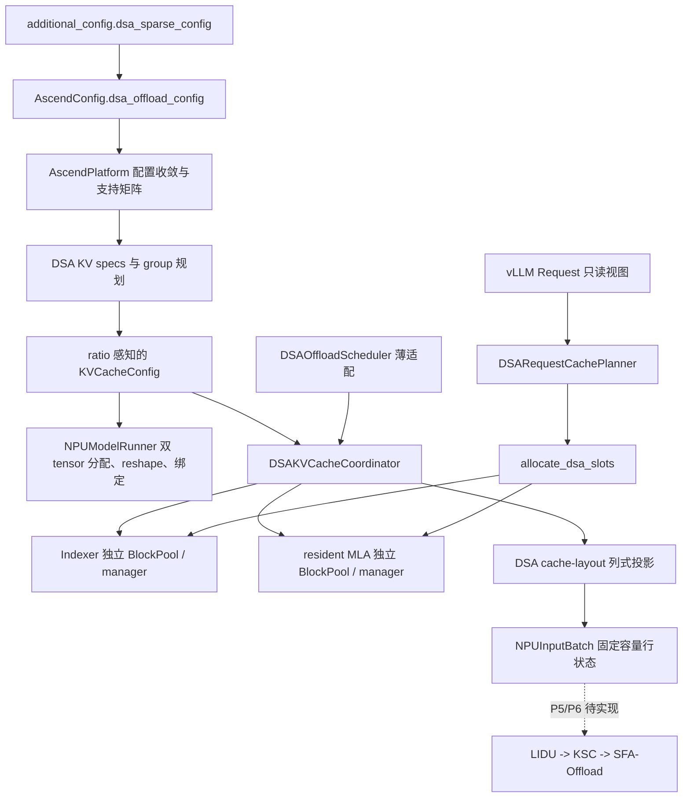

# DSA 稀疏卸载当前设计

> - 最后更新：2026-07-28
> - 目标基线：vLLM v0.23.0 + vLLM-Ascend v0.23.0
> - 当前完成度：P0-P4 控制面与 worker 行投影已实现；P4 等待 910C
>   验证，P5-P7 尚在迁移
> - 首要验收模型：GLM-5.1；兼容回归模型：DeepSeek-V3.2

## 1. 文档定位

本文描述 **v0.23 迁移分支当前已经落地的设计**。它与
`dsa_offload_v023_migration_plan.md` 分工如下：

- 本文回答“当前代码是什么结构、谁持有什么真源、稳定不变量是什么”；
- 迁移计划回答“新旧基线有什么差异、下一阶段做什么、测试证据是否齐全”。

迁移过程中每完成一个阶段，应先按实际代码更新本文，再在迁移计划中记录
验收结果。尚未实现的 P5-P7 只列接口边界，不写成可运行能力。

## 2. 目标与当前边界

DSA 稀疏卸载最终目标是在长上下文 decode 中实现：

1. Indexer K 保存完整上下文并驻留 HBM；
2. MLA 完整满块卸载到 worker 本地 hot DRAM；
3. HBM MLA 只保留有界 resident budget 与当前稠密尾块；
4. LIDU 选择重要 token 并更新 resident 映射；
5. KSC 只换入本轮 miss token；
6. SFA-Offload 消费重要 token 与尾块完成注意力计算。

当前代码已经完成：

- `additional_config["dsa_sparse_config"]` 的类型化解析和支持矩阵校验；
- 模型能力判断；
- Indexer/MLA HBM spec、容量、tensor、block pool 和绑定解耦；
- scheduler/core 侧请求 cache 布局规划；
- PREFILL、DENSE、ENTER、SPARSE 的双 pool block 分配；
- prefill 输出返回后的 resident 满块释放时序；
- 不复制上游 `Scheduler.schedule()` 的薄调度适配；
- scheduler/core 已提交状态到 worker 最终 `InputBatch` 行序的列式投影；
- ENTER 的 resident MLA block table 全量替换。

当前尚未完成：

- DRAM arena、满块 dump 和请求 ledger；
- LIDU、KSC、SFA-Offload 的 eager 数据面；
- DSA FULL graph；
- prefix cache、chunked prefill、prefill/decode mixed、preemption/resume、
  speculative/MTP、async scheduling、KV transfer 和 A5 设备验收。

因此，已有 `cache-init` 结果只证明 P0-P3 的控制面和 HBM 物理初始化成立；
P4 仍需 910C 单测验证。即使 P4 通过，也不能据此宣称稀疏卸载数据面已经
生成。

## 3. 当前总体架构



当前有三个不同层次的真源：

| 层次 | 真源 | 当前所有者 |
|---|---|---|
| 用户配置 | 解析后的不可变 DSA 配置 | `AscendConfig.dsa_offload_config` |
| 请求 cache 布局 | 阶段、冻结预算、resident 有效长度 | `DSARequestCachePlanner` |
| 物理块表 | 两个 plane 的 request→blocks 映射 | `DSAKVCacheCoordinator` 下的两个 manager |

worker 行状态是上述 scheduler/core 真源的 **投影**，不是第二套请求阶段
账本。eager 与 graph 后续都必须消费这个投影和同一个 buffer owner。

## 4. 与 v0.23 基线的集成方式

### 4.1 不修改 vLLM

实现只修改 vLLM-Ascend。vLLM 的 `Request`、`SchedulerOutput` 和
`Scheduler.schedule()` 均未修改或复制。DSA 使用 vLLM-Ascend 自有的薄
`DSAOffloadSchedulerOutput` 子类增加一个类型化 projection 字段，不对
上游类做 monkey patch 或运行期动态挂字段。

### 4.2 使用基线扩展点

| v0.23 扩展点 | DSA 用法 |
|---|---|
| `AscendConfig` | 解析并持有 `DSAOffloadConfig` |
| `KVCacheSpecRegistry` | 注册 DSA Indexer/resident spec 与 manager |
| KV group/config hook | 构造两个物理 group 和 ratio 容量 |
| coordinator factory | 创建 `DSAKVCacheCoordinator` |
| `scheduler_config.scheduler_cls` | 安装薄 `DSAOffloadScheduler` |
| `SchedulerOutput` dataclass | 浅包装为只增加一个 projection 的 Ascend 子类 |
| `NPUInputBatch` | 持有固定容量 DSA SoA 行状态 |
| `NPUModelRunner` cache 初始化 | 分配、reshape、绑定两个独立 plane |

v0.19 依靠全局 monkey patch 修改 `Request`、Scheduler 和输出结构。v0.23
迁移只保留其功能合同，不照搬旧 patch 拓扑。

## 5. 配置与模型能力

配置入口保持为：

```python
additional_config={
    "dsa_sparse_config": {
        "enabled": True,
        "split_indexer_cache": True,
        "indexer_mla_block_ratio": 3,
        "sparse_activation_tokens": 6144,
        "prompt_budget_thresholds": [32768, 65536],
        "resident_budget_tokens": [6144, 10240, 12288],
        "max_active_reqs": 256,
        "hot_cpu_block_multiple": 3.0,
        "enable_row_mode_decode_graph": False,
    }
}
```

`config.py` 在拉起期完成类型转换、未知字段拒绝和支持矩阵校验。当前首版
显式拒绝 async scheduling、chunked prefill、prefix cache、speculative
decode、KV transfer、context/pipeline parallel 等未建立完整合同的组合。

模型支持采用能力判断，不仅依赖 architecture 名称。模型必须具备：

- MLA attention；
- sparse Indexer；
- 与当前 SFA 合同一致的 `index_topk`；
- DSA 所需的模型维度和 cache dtype。

## 6. HBM 双平面

### 6.1 Spec

`DSAIndexerKVSpec` 描述完整 Indexer K。每 token 只有一个 K 向量，因此覆盖
`FullAttentionSpec` 默认 K+V page 字节数。

`DSAResidentMLAAttentionSpec` 描述 resident MLA。它的
`sparse_head_dim` 不再包含 Indexer 维度，防止 MLA page 重复核算 Indexer。

两个不同的 spec identity 让 v0.23 registry 将它们保留为独立 cache group。

### 6.2 容量与 group

finalized `KVCacheConfig.num_blocks` 表示 resident MLA 的 base blocks。
Indexer 容量通过最终 `KVCacheTensor.size` 表达为：

```text
indexer blocks = resident base blocks * indexer_mla_block_ratio
```

KV group 顺序固定为 Indexer 在前、resident MLA 在后；运行期仍通过
`DSAKVCacheGroupIds` 按 spec identity 解析 group id，不在热路径假设固定
下标。

worker 的同层绑定顺序则固定为 resident MLA 在前、Indexer 在后。这是绑定
ABI，不等同于 group 顺序。

### 6.3 Worker tensor

Indexer plane 恢复为：

```text
[num_indexer_blocks, block_size, num_kv_heads, head_size]
```

它没有独立 attention backend 或 metadata builder，只作为 resident MLA
forward 中 LIDU 的 cache 输入。

resident MLA 继续复用 Ascend MLA backend 的 tensor 表示，但不再内嵌
Indexer K。两张 tensor 在初始化后分别绑定到共享模型层。

## 7. 请求 cache 布局账本

### 7.1 为什么不是新的 request lifecycle

`request_cache_layout.py` 不接管 vLLM 的 waiting/running/finished/preempted
状态。它只记录 DSA cache 应采用的物理布局：

| 阶段 | Indexer plane | resident MLA plane |
|---|---|---|
| `PREFILL` | 完整 prompt | 完整 prompt，供 prefill 与后续 dump |
| `DENSE_DECODE` | 完整上下文 | 完整上下文 |
| `ENTER_SPARSE_DECODE` | 完整上下文继续增长 | 一次性替换为 budget + tail |
| `SPARSE_DECODE` | 完整上下文继续增长 | 物理表稳定，有效尾长继续变化 |

### 7.2 持久状态

每个活动请求只持有一个 slotted `DSARequestCacheState`：

- `stage`；
- `target_resident_budget_tokens`；
- `sparse_budget_tokens`；
- `resident_valid_tokens`；
- `prefill_resident_released`。

目标 budget 在请求首次成功 admission 时按 prompt token 数选择，decode
期间不换档。`sparse_budget_tokens` 与 `resident_valid_tokens` 保留为 P4
worker 投影真源，避免 worker、eager 和 graph 各自重新计算。

### 7.3 Plan/commit

每次 `allocate_slots` 只创建一个 slotted、不可变
`DSARequestCachePlan`：

1. `plan()` 计算候选阶段和两个 plane 的需求，不修改持久 state；
2. manager 分别检查两个物理 pool；
3. 容量满足后修改 block table；
4. `commit()` 原地刷新请求唯一 state；
5. 容量不足返回 `None`，state 与 resident 表不推进。

`tail_tokens` 和 ENTER 的 resident 整表替换标志是 plan 的派生属性，不额外
存储。planner 不在 steady decode 重建跨 step state。

## 8. 双 pool 分配

`DSAKVCacheCoordinator` 为两个 group 持有独立 `BlockPool` 和 manager：

- `DSAIndexerKVCacheManager` 保存完整上下文块；
- `DSAResidentMLAKVCacheManager` 保存 dense 或 resident 布局块。

分配规则：

- PREFILL/DENSE 同时扩展两个 plane；
- ENTER 先完成双 pool 容量预检，再释放 resident 旧满块、按预算重建表并
  保留原不满尾块；
- SPARSE 只扩展 Indexer，resident 物理块表必须与预期 budget+tail 容量一致；
- free 同时清理两个 manager 和请求 cache state。

当前不支持 prefix hit、lookahead、external computed tokens 和 delayed
allocation；这些组合在分配边界再次显式拒绝。

## 9. 薄 Scheduler

`DSAOffloadScheduler` 继承上游 Scheduler，但不复制主循环。它只补充：

1. 首版 prefill/decode phase barrier；
2. waiting prefill 只有在两个 pool 都可 admission 时才阻塞 decode；
3. model output 返回后释放已同步 dump 的 prefill resident 满块；
4. preemption/resume 尚未支持时显式失败。

没有 waiting/skipped-waiting 的 steady decode 直接进入
`super().schedule()` 快路径，不做额外队列扫描。

当前满块 dump 目标设计假设与模型 forward 位于同一 NPU stream，stream 内
保序。未来改为异步多 stream 时，必须新增 event/readiness 协议，不能只凭
host 输出返回释放 HBM 块。

## 10. P4 实现与 P5-P7 接口边界

### 10.1 P4：scheduler→worker 投影

P4 已实现以下合同：

- `DSARequestCacheLayoutProjection` 按 scheduled request 顺序列式承载
  stage、target/sparse budget、resident valid length；
- `DSAOffloadSchedulerOutput` 浅包装原生输出，基线字段继续共享原对象；
- 多进程 pickle 往返保留 projection 类型和内容；
- worker 先执行原生 `_update_states()` 的 remove/add/condense/reorder，
  再通过 `req_id_to_index` 投影到最终行序；
- `DSAInputBatchCacheLayout` 使用一个 `[4, max_num_reqs]` 的固定容量
  `CpuGpuBuffer`。四个 SoA 列在 device 侧均为连续向量；
- eager 后续使用 active-prefix，graph 使用 captured-prefix + PAD，
  二者共享同一个 owner；
- 只有 ENTER 行携带 resident 全量 block IDs，并覆盖 worker request
  账本与对应 `MultiGroupBlockTable` 行；其他阶段不额外改写 block table。

P4 明确不做：

- 在 worker 各 rank 根据长度重新决定阶段；
- 为 eager 和 graph 创建两套语义状态；
- 每 step 构造多份 request-id→scalar Python 字典。
- 提前 H2D 或连接任何 DSA 算子；P5/P6 将复用已有固定地址 owner。

### 10.2 P5：eager 数据面

按 prefill dump、DENSE、ENTER、SPARSE、decode dump 的顺序接通 DRAM
ledger 与 LIDU/KSC/SFA-Offload。Indexer 与 resident metadata 应复用
v0.23 `NPUInputBatch`、`MultiGroupBlockTable` 和 attention metadata
构建范式。

### 10.3 P6：图模式

复用 v0.23 原生 FULL decode capture/replay。DSA 只增加固定地址 buffer、
PAD 行和准入条件，不创建第二套 graph dispatcher 或 graph-only cache
语义。

### 10.4 P7：场景扩展

preemption、prefix cache、MTP、chunked/mixed prefill 和 KV transfer 都会
改变 ledger 或状态恢复合同，应在稳定 eager/graph 数据面之后逐项设计。

## 11. 代码索引

| 模块 | 当前职责 |
|---|---|
| `dsa_offload/config.py` | 类型化配置和支持矩阵 |
| `dsa_offload/model_support.py` | 模型能力判断 |
| `dsa_offload/kv_cache.py` | spec、group、容量、绑定顺序和报告 |
| `dsa_offload/kv_cache_coordinator.py` | 双 pool 所有权和请求块表 |
| `dsa_offload/kv_cache_manager.py` | 阶段感知的实际 block 分配 |
| `dsa_offload/request_cache_layout.py` | 请求 cache 布局 plan/commit |
| `dsa_offload/scheduler.py` | 薄 phase barrier 与输出后释放 |
| `dsa_offload/scheduler_output.py` | scheduler→worker 最小列式投影 |
| `dsa_offload/input_batch.py` | worker 固定容量行状态与 ENTER 整表覆盖 |
| `core/kv_cache_interface.py` | DSA spec/manager registry 注册 |
| `worker/npu_input_batch.py` | 可选 DSA buffer owner |
| `worker/model_runner_v1.py` | cache 初始化及基线行重排后的 DSA 投影 |
| `platform.py` | 配置收敛、scheduler 类和启动期校验 |

## 12. 当前验证状态

已获得的 910C 证据：

- P0-P3 单元测试 59 项全部通过，无 skip、xfail 或失败；
- DSA disabled GLM-5.1 回归通过；
- DSA `cache-init` 成功；
- HBM 容量报告只打印一次；
- `async_scheduling=True` 按支持矩阵拒绝；
- Indexer/MLA 3:1 容量和双 tensor 初始化符合预期。

P3 的请求布局、双 manager 失败原子性与 scheduler 薄适配已经在
Linux + Ascend 环境通过 UT。P4 的 projection pickle、最终行序重排、
ENTER 整表覆盖和 PAD 初始化共 5 项纯 CPU 测试在本地通过；完整 910C
回归待执行。P5 数据面尚未接通，因此当前仍不以长请求端到端稀疏生成作为
验收项。完整命令和逐阶段验收结果维护在迁移计划中。
